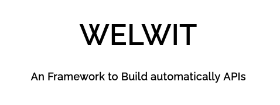

#

<h1 align="center">
    
    

    Welwit Framework
    

</h1>

  
  

Welwit is an CLI Framework based API and ORM builder, made to automate API development and database modeling. Supports costum route creation, code generation, automated scripts and much more.
Currently in alpha development, check the section #roadmap for more details.

## Overview

<i>Note:This is an detailed explanation of the program. For quick setup skip to last session <3 .</i>

 
There are 3 main options for API-GRAN to use, <strong>server, generate</strong> and <strong>database</strong>.

### Server

The server mode generate an full server within just two files, the first contains the database configuration, and the second all the tables you might want to include (not required at all). For the server you just need to configure an file, call it any name you want, but <strong>.gra</strong> is cool to :) .

Base configuration file:
<pre style="background-color: rgb(34, 34, 34); color : whitesmoke;">
    server={
        "ip" : IP,
        "port" : PORT,
        "orm" : DATABASE_ORM,
        "database" : DATABASE
    };
</pre>

Where:
<table>
    <tr>
        <th>Option</th>
        <th>Explanation</th>
        <th>Example</th>
    </tr>
    <tr>
        <th>IP</th>
        <th>Your machine ip</th>
        <th>127.0.0.1</th>
    </tr>
    <tr>
        <th>PORT</th>
        <th>Database port</th>
        <th>3306</th>
    </tr>
    <tr>
        <th>ORM</th>
        <th>ORM to use</th>
        <th>sequelize</th>
    </tr>
    <tr>
        <th>DATABASE</th>
        <th>Database name to use</th>
        <th>my_database</th>
    </tr>
</table>

Example, <strong>config.txt</strong> contains the following:
<pre style="background-color: rgb(34, 34, 34); color : whitesmoke;">
server={
    "ip" : "127.0.0.1",
    "port" : 3306,
    "orm" : "sequelize",
    "database" : "my_database"
};
</pre>
There are more options fo include in the config file,and can be added as it follows, separed by <strong>;</strong> (example):
<pre style="background-color: rgb(34, 34, 34); color : whitesmoke;">
option1={
    "value1" : "foo",
    "value2" : "bar",
};
option2={
    "value1" : "foo",
    "value2" : "bar",
};
option3={
    "value1" : "foo",
    "value2" : "bar",
};
</pre>
 
The second file contains all the database you want to include for the API, also the routes. The basic structure looks like:
<pre style="background-color: rgb(34, 34, 34); color : whitesmoke;">
    table_name={
        FIELD1 : TYPE,
        FIELD2 : TYPE,
        FIELD3 : TYPE,
    };
</pre>
Multiple tables can be included tho:
<pre style="background-color: rgb(34, 34, 34); color : whitesmoke;">
    table1={
        FIELD1 : TYPE,
        FIELD2 : TYPE,
        FIELD3 : TYPE,
    };
    table2={
        FIELD1 : TYPE,
        FIELD2 : TYPE,
        FIELD3 : TYPE,
    };
    table3={
        FIELD1 : TYPE,
        FIELD2 : TYPE,
        FIELD3 : TYPE,
    };
</pre>
Since you're building an API, you might want to specify the routes where those tables will interact with the user, put your path inside "<>" as the example:
<pre style="background-color: rgb(34, 34, 34); color : whitesmoke;">
    table1={
        FIELD1 : TYPE,
        FIELD2 : TYPE,
        FIELD3 : TYPE,
    }<<code>/v1/login</code>>;
    table2={
        FIELD1 : TYPE,
        FIELD2 : TYPE,
        FIELD3 : TYPE,
    }<<code>/v1/register</code>>;
    table3={
        FIELD1 : TYPE,
        FIELD2 : TYPE,
        FIELD3 : TYPE,
    }<<code>/v1/post</code>>;
</pre>
API grandma will automatically create the GET and POST router for the tables, no REST support is currently implemented (in development).

#### Table Tutorial
##### Base
The following is an example of a table:

<pre style="background-color: rgb(34, 34, 34); color : whitesmoke;">
login={
    id : INT~20-PK-AI,
    user : STR~20,
    password : STR~20
}<<code>/v1/account</code>>;
</pre>

How it works? The parser will identify the field type and the special attributes and add automatically to the code being generated.

In detail, the first line <strong>id : INT~20-PK-AI</strong> is splited with "-" to:

<pre style="background-color: rgb(34, 34, 34); color : whitesmoke;">
[
    "INT~20",
    "PK",
    "AI"
]
</pre>

The code is translated as (SQL like) command:
<code >
    id INT(20) primary key auto_increment
</code>
"INT~20" is:
<ul>
    <li>INT -> Datatype, INT
    <li>20 -> Field lenght
</ul>
PK, AI are translated to "primary key" and "auto_increment", resulting to this SQL statement for the "login" table:
 
<code style="background-color: rgb(34, 34, 34); color : whitesmoke;">
create table login(
    id INT(20) primary key auto_increment,
    user varchar(20),
    password varchar(20) 
);
</code>
 
 
And that is! You finished the basic setup. For complete overview of the table generation methods, check the examples above.

#### Table definition and examples
Basic table creation
<pre style="background-color: rgb(34, 34, 34); color : whitesmoke;">
table_name={
    field1 : type,
    field2 : type,
    field3 : type,
    field(n) : type(n)
}<<code>/api/path/here</code>>;
</pre>
<strong>Multiple tables</strong>
<pre style="background-color: rgb(34, 34, 34); color : whitesmoke;">
document={
    id : INT~20-PK-AI,
    number : STR,
    date : DATE,
    region : STR~10
}<<code>/v1/document</code>>;
account={
    id : INT~20-PK-AI,
    name : STR~20,
    country : INT~20
}<<code>/route/account</code>>;
</pre>

Ok, whe have the base server and table config files. Building will be like:

<pre style="background-color: rgb(34, 34, 34); color : whitesmoke;">
node app.js --server --input=server.txt --tables=tests/input/test1.txt --orm=sequelize --output=tests/output/
</pre>

Where

<pre style="background-color: rgb(34, 34, 34); color : whitesmoke;">
    --server         -> Server mode
    --input=         -> Server config file
    --tables=        -> Tables config file
    --orm=           -> Prefered orm (if not specified, sequelize will be used)
    --output=        -> Path to output
</pre>
And then, there is the terminal output:
<pre>

</pre>
Then, run "npm install <ORM>" to install it localy inside the project output. If you specified Sequelize, run "npm install sequelize".
Note: mysql2 may be required for sequelize or another in your generated project, run "npm install mysql2" to fix it.

 
Finally, start the app via "node app.js" and have fun :) <3>.
### Generate

Creates base server, in development...

<strong>Note:</strong> "--database --input=tables.txt" is equivalent to "--tables=tables.txt", the main difference is their purpose, since option1 is for simple database/table generation and option2 is for database/table generation along with server routes, and tests. Avoid using then at the same time!
Recomended: output to 'output' folder with different dirs.

<code>
    node app.js --generate --input=input.txt --output='output/myapp/'
</code>

### Database

This option only generates the database tables. The table setup is the same, but uses differents params. (in development, do not use yet)

<code>
    node app.js --database --orm=sequelize --input=input.txt
</code>

### Quick setup

Create two files, one called <strong>config.txt</strong> and another <strong>tables.txt</strong>. 
 
Insert code bellow into <strong>config.txt</strong>:

<pre style="background-color: rgb(34, 34, 34); color : whitesmoke;">
server={
    "ip" : "127.0.0.1",
    "port" : 3306,
    "orm" : "sequelize",
    "database" : "book_store"
};
</pre>
Note: create an database named book_store first.
 
And for <strong>tables.txt</strong>:
<pre style="background-color: rgb(34, 34, 34); color : whitesmoke;">
    book={
        id : INT~20-PK-AI,
        name : STR~20,
        author : STR~20,
        creation : DATE
    }<<code>/v1/book</code>>;
    client={
        id : INT~20-PK-AI,
        name : STR~20,
        age : STR~20
    }<<code>/v1/client</code>>;
</pre>

Create an tests folder with the structure:
<ul>
    <li>tests<li>
    <li>
        <ul>
            <li>input</li>
            <li>output</li>
        </ul>   
    </li>
</ul>

Save the files to tests/input and execute the following code from grandma:
<pre style="background-color: rgb(34, 34, 34); color : whitesmoke;">
    node app.js --server --input=tests/input/config.txt --tables=tests/input/tables.txt --orm=sequelize --output=tests/output/
</pre>

Move to the tests/output dir, open the terminal and type:
<pre style="background-color: rgb(34, 34, 34); color : whitesmoke;">
    npm init -y
    npm install sequelize
    npm install mysql2 # may be required
    npm install

    Depending of your os, you may run:

    ./start.bat        # windows
    sh start.sh        # linux

    Finally

    node app.js
</pre>
POST requests to send
 1
<code>
POST /v1/book HTTP/1.1
Host: 127.0.0.1:9999
Content-Type: application/x-www-form-urlencoded

id=0&name=StrangerThings&author=Homer Simpson&creation=12/12/2021
</code>
 2
<code>
POST /v1/book HTTP/1.1
Host: 127.0.0.1:9999
Content-Type: application/x-www-form-urlencoded

id=0&name=Javascript Hell&author=Devil&creation=12/12/2021
</code>
 3
<code>
POST /v1/book HTTP/1.1
Host: 127.0.0.1:9999
Content-Type: application/x-www-form-urlencoded

id=0&name=Made by Angola&author=Heber Julio&creation=12/12/2021
</code>
GET request:
<code>
GET /v1/book HTTP/1.1
Host: 127.0.0.1:9999
</code>

## Meaning and convections

---------------------------------------------------------------------------------------------
API GRANDMA | SEQUELIZE
------------------------------------------------|--------------------------------------------
INT | INTEGER
STR | STRING
PK | PRIMARY KEY
---------------------------------------------------------------------------------------------
## Supported ORMs
_____________________________________________________________________________________________
Database | CRUD | PrimaryKeys | 1:1 | 1:n | n:n | Status | Experimental | Production
---------|------|-------------|-----|-----|-----|--------|--------------|--------------------
Sequelize | Yes | No | No | Yes | Incomplete | No | Yes | Basic API
_____________________________________________________________________________________________
</code>

# Roadmap (not ordered)

* Fix bug about primary key not being filled [Done]
* Typescript migration
* Code refactoring and review
* Add support to TypeORM and more databases
* Add option to use mysql or mongodb (anything excepto than ORM)
* Export some functions to classes
* Bug fix for directy creation (mitigated with app executed twice) [Done]
* Add more options to create API
* REST support
* Export API following Software Principles and convections (SOLID, MVC, MVP and so on)
* Upgraded parser
* Better documentation

### Work with me
My social media
<ul>
    <li>Facebook : Soon...</li>
    <li>Linkedin : https://ao.linkedin.com/in/h%C3%A9ber-j%C3%BAlio-496120190/</li>
</ul>
